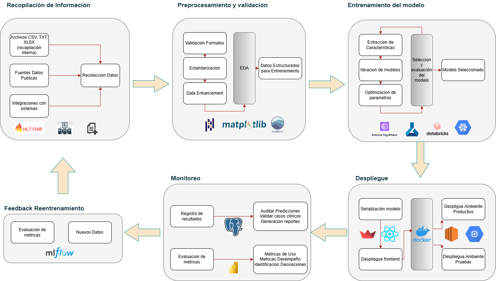

# Pipeline de MLOps para Predicción Clínica – Proyecto de Laboratorio

## 1. Introducción del Caso

### Contexto
El crecimiento exponencial de los datos clínicos en instituciones de salud ha abierto nuevas oportunidades para aplicar técnicas de machine learning que permitan apoyar el diagnóstico, la predicción de enfermedades y la toma de decisiones clínicas. Sin embargo, enfermedades poco frecuentes o con manifestaciones clínicas ambiguas presentan desafíos particulares debido a la escasez de datos estructurados, su dispersión y su variabilidad.

### Objetivo
Diseñar e implementar un pipeline de MLOps que permita construir, desplegar, mantener y monitorear un modelo predictivo clínico. Este pipeline debe ser robusto, trazable, reproducible y escalable, incorporando herramientas modernas y prácticas recomendadas.

### Alcance
El pipeline cubrirá desde la adquisición y validación de datos clínicos hasta el despliegue en ambiente productivo mediante microservicios y su monitoreo en tiempo real. Se enfoca en un flujo automatizable y modular adaptable a distintos escenarios clínicos.

### Suposiciones
- Se dispone de un dataset clínico anonimizados estructurado en CSV y complementado con acceso a una API FHIR para casos reales.
- Las variables objetivo son binarias (presencia o ausencia de una condición médica).
- Los datos no contienen sesgos legales o éticos que impidan su uso para modelos predictivos.
- La predicción se debe generar de forma individualizada por paciente y ser trazable.

## 2. Diagrama del Pipeline

Se propone un pipeline modular compuesto por las siguientes fases principales:
1. Entrenamiento offline
2. Serialización y despliegue
3. Predicción diaria y monitoreo
4. Visualización y registro

Cada fase incluye tecnologías específicas:
- Entrenamiento: Jupyter, Pandas, Scikit-learn, DVC
- Despliegue: FastAPI, Docker, Streamlit
- Almacenamiento: PostgreSQL, S3 (opcional)
- Monitoreo: Prometheus, Grafana, MLflow

## 3. Entrenamiento Offline

### Inicio del Proceso
Se utiliza Git como sistema de control de versiones y GitHub Actions para automatizar pruebas, validaciones y preparación de entornos. Las notebooks de exploración se desarrollan en Jupyter debido a su flexibilidad para prototipado rápido, visualización integrada y compatibilidad con flujos colaborativos en entornos clínicos-académicos.

### Entrada de Datos
- Fuentes: CSV clínicos estructurados y API FHIR
- Justificación: CSV permite iteración rápida en entornos locales y facilita la anonimización; FHIR estandariza la interoperabilidad con sistemas clínicos reales, lo que permite futuras integraciones automatizadas con historias clínicas electrónicas.
- Validaciones: detección de nulos, tipos inconsistentes, unidades no estándar.
- Suposición: Los datos están anonimizados y normalizados según normas HL7.
- Implicación: evita conflictos de interoperabilidad al entrenar y desplegar el modelo.

### Exploración y Extracción de Características
Se realiza una exploración EDA y selección de variables predictivas:
- Técnicas: imputación, normalización, reducción de dimensionalidad
- Justificación: Evitar overfitting y garantizar interpretabilidad. La elección de estas técnicas se basa en la necesidad de resultados clínicamente explicables y compatibles con decisiones médicas.

### Iteración de Modelos
Se entrenan modelos basados en árboles (XGBoost) y redes neuronales simples con validación cruzada estratificada. XGBoost fue elegido por su alto desempeño con datos tabulares, su capacidad de manejar datos faltantes, su eficiencia computacional y su habilidad para capturar relaciones no lineales sin requerir normalización de datos. Además, permite interpretar la importancia relativa de las variables, lo cual es útil para auditar y validar la lógica médica del modelo.

Las redes neuronales simples fueron incluidas como complemento, ya que permiten explorar patrones no lineales complejos y posibles interacciones entre variables que no son fácilmente capturadas por modelos basados en árboles. Sin embargo, se optó por mantener la arquitectura de red en un nivel básico para evitar problemas de sobreajuste, dado el tamaño y la variabilidad de los datos clínicos disponibles.

No se priorizaron modelos como SVM o regresión logística debido a varias razones técnicas y clínicas: SVM requiere mayor ajuste de hiperparámetros y puede ser menos escalable en grandes volúmenes de datos; la regresión logística, aunque interpretable, no ofrece la flexibilidad necesaria para capturar relaciones complejas entre variables. Por su parte, los modelos bayesianos fueron descartados debido a su alta demanda computacional y a la dificultad de ajustar correctamente las distribuciones previas en un contexto clínico con alta incertidumbre en los datos.

### Suposiciones clave
- Las clases están balanceadas luego de aplicar técnicas de re-muestreo.
- El dataset final se divide en train (80%) y test (20%) sin fuga de información.

## 4. Serialización y Despliegue

### Serialización del Modelo
Se usa `joblib` para guardar el modelo y el pipeline de preprocesamiento completo cuando se desea una integración directa con bibliotecas como scikit-learn. Sin embargo, para favorecer la portabilidad entre entornos y la interoperabilidad entre frameworks, también se realiza la conversión del modelo final a formato `ONNX` (Open Neural Network Exchange).

La elección de ONNX se justifica por su capacidad de representar modelos entrenados en distintos frameworks (como PyTorch, TensorFlow o scikit-learn) y permitir su ejecución optimizada en entornos heterogéneos, incluyendo dispositivos edge o motores de inferencia acelerados. Esta flexibilidad lo convierte en un estándar industrial emergente para el intercambio de modelos en producción.

En consecuencia, el flujo de serialización incluye:
- Exportación a `.pkl` con joblib para trazabilidad y compatibilidad con pipelines de entrenamiento.
- Conversión y validación en formato `.onnx` para despliegue universal y ejecución eficiente en producción.

### Empaquetado con Docker
Se crea una imagen Docker con:
- Modelo serializado
- API REST FastAPI
- Validaciones de entrada y logging estructurado

Docker fue seleccionado como mecanismo de empaquetado y despliegue debido a su capacidad para encapsular todo el entorno de ejecución de forma estandarizada, asegurando portabilidad y reproducibilidad. A diferencia de entornos virtuales como Conda o `venv`, Docker permite definir la infraestructura como código y facilita su integración en pipelines CI/CD, lo que reduce errores en entornos clínicos donde la validación y trazabilidad son esenciales.

Si bien soluciones serverless como AWS Lambda fueron consideradas, se descartaron por sus limitaciones de tiempo de ejecución, restricción de recursos y dificultad para manejar cargas constantes o servicios con estado. Docker ofrece un mayor control sobre el entorno de ejecución, acceso a configuraciones personalizadas y es compatible con despliegues locales, en la nube o bajo orquestadores como Kubernetes, lo que lo convierte en la opción más versátil para este proyecto.

### Despliegue
El contenedor se ejecuta localmente o en servicios como EC2. Opcionalmente se puede orquestar con Docker Compose o Kubernetes si se requiere escalabilidad horizontal.

### Suposición
- La predicción se consume vía endpoint REST.
- El sistema garantiza respuesta en menos de 2 segundos por solicitud.

## 5. Predicción Diaria y Monitoreo

### Flujo de Predicción
- Carga automática de nuevos datos desde API o formulario Streamlit
- Envío al endpoint FastAPI
- Respuesta estructurada + persistencia en PostgreSQL

### Registro de Resultados
Cada predicción se registra con:
- Timestamp
- Versión del modelo
- Datos de entrada y resultado

### Monitoreo
Se implementa Prometheus para captura de métricas operativas (latencia, volumen de solicitudes, errores) y Grafana para su visualización en dashboards. Además, se incorpora MLflow como herramienta complementaria para el monitoreo del desempeño del modelo desde una perspectiva de machine learning. MLflow permite:
- Registrar las métricas de entrenamiento e inferencia.
- Controlar versiones de modelos desplegados.
- Comparar experimentos anteriores.
- Facilitar la trazabilidad técnica para auditores o científicos de datos.

Estas herramientas fueron elegidas por su facilidad de integración con servicios Dockerizados, su compatibilidad con flujos de MLOps modernos, y su capacidad de personalización. Superan en flexibilidad y simplicidad a opciones como ELK o herramientas propietarias.

### Justificación
El monitoreo es crítico para detectar degradación del modelo o cambios en el entorno clínico. También facilita auditorías posteriores.

## 6. Parte Implementada

### Componentes Desarrollados
- API REST funcional en FastAPI
- Interfaz Streamlit interactiva
- Dockerfile para backend y frontend
- Pruebas locales exitosas de comunicación entre módulos

### Suposiciones
- El usuario es personal clínico con conocimientos básicos de tecnología
- El modelo se comporta de forma estable en entornos controlados

## 7. Proyecciones a Futuro

### Escalabilidad
- Migración a servicios como AWS ECS o Cloud Run por su capacidad de escalar automáticamente sin necesidad de gestión de infraestructura compleja. Estas opciones fueron priorizadas frente a otras alternativas como Kubernetes o AWS Lambda por razones específicas:
  - Kubernetes, aunque muy potente, implica una curva de aprendizaje considerable y una mayor responsabilidad operativa. Dado que el proyecto se encuentra en una etapa inicial, se priorizó la simplicidad operativa y la facilidad de despliegue que ofrecen ECS y Cloud Run.
  - AWS Lambda (serverless) fue descartado inicialmente porque impone restricciones en tiempo de ejecución, tamaño de despliegue y latencia que podrían limitar el rendimiento del modelo, especialmente en casos donde se requiere baja latencia y disponibilidad constante del servicio.
- Orquestación con Airflow para reentrenamiento automático en función de métricas o cambios en datos.
- Almacenamiento en S3 y PostgreSQL gestionado para reducir carga operativa.

### Seguridad y trazabilidad
- Integración con OAuth2 para autenticación
- Registros en JSONL con backup automático y cifrado

### Multiversión y reentrenamiento
- DVC para versionar datasets
- GitHub Actions para automatizar pipelines de retraining, habilitando entrenamiento bajo demanda o programado